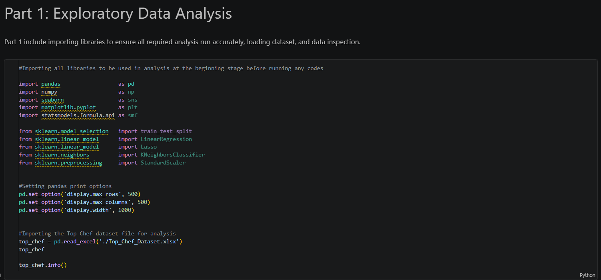

# Predicting_Customer_Revenue_with_Machine_Learning
A machine learning analysis of ~2,000 customer records, using customer behaviour and engagement data to predict revenue with 65.9% explanatory power and support targeted marketing and retention decisions.

### Note: 

This repository outlines the full analytical and technical process used to predict customer revenue, from Python-based exploratory data analysis and data preparation through to feature engineering and regression-based machine learning modelling. Key findings, model performance, and potential business value and financial impact are provided throughout the project.

## Table of Contents

This repository presents the end-to-end process used to explore customer revenue and develop predictive machine learning models, from understanding the business problem and data through to model evaluation and potential business impact.

1. [Project Overview](#project-overview)
2. [The Dataset](#the-dataset)
3. [Part 1: Exploratory Data Analysis](#exploratory-data-analysis)
4. [Part 2: Data Preparation & Feature Engineering](#data-preparation--feature-engineering)
5. [Part 3: Predictive Modelling](#predictive-modelling)
6. [Part 4: Model Evaluation](#model-evaluation)
7. [Part 5: Key Findings](#key-findings)
8. [Business Value & Financial Impact](#business-value--financial-impact)
9. [Tools & Technologies](#tools-&-technologies)
10. [Technical Skills Demonstrated](#technical-skills-demonstrated)
---

## 1. Project Overview

Top Chef is a gourmet meal-delivery business with ~2,000 customer records containing purchasing behaviour, engagement, and account-level information. While this data captured how customers interacted with the business, it did not clearly show which behaviours were associated with higher revenue or how customer data could be used to predict revenue potential.

As a result, the business needed to understand:

- Which customer behaviours and engagement patterns are associated with revenue?
- How effectively can customer-level data be used to predict customer revenue?
- How could these predictions support more targeted marketing and retention decisions?

This project addresses that gap through exploratory data analysis, feature engineering, and machine learning regression modelling to predict customer revenue and demonstrate how these insights could support more informed customer and commercial decisions.

---

## 2. The Dataset

The analysis uses a dataset of approximately **2,000 Top Chef customers**, with each record representing an individual customer. The data includes information on customer purchasing behaviour, engagement with Top Chef's services, customer interactions and account characteristics.

| Data Area | Examples |
|---|---|
| Purchasing Behaviour | Meal orders, order size and cancellations |
| Customer Engagement | Videos, feedback, photos and cooking classes |
| Customer Interactions | Customer service and survey engagement |
| Account Characteristics | Customer and email-domain information |
| **Target Variable** | **REVENUE** |

The objective was to explore how these customer characteristics relate to revenue and use them to develop predictive models.

---

## 3. Part 1: Exploratory Data Analysis

### Initial Setup and Data Inspection

The analysis began by importing the required Python libraries, loading the Top Chef customer dataset and inspecting the dataset structure before beginning exploratory analysis.

The analysis began by examining the dataset structure, variable types, descriptive statistics, missing values and the distribution of the target variable, `REVENUE`. Customer behaviour and engagement variables were then explored to identify patterns and relationships that could inform the predictive modelling stage.

### Revenue Distribution

The distribution of `REVENUE` was examined to understand how customer revenue was distributed across the dataset.

`REVENUE` was **right-skewed**, indicating that most customers generated relatively lower levels of revenue, while a smaller group generated substantially higher revenue.

> **Key Insight:** Customer revenue was unevenly distributed, with a relatively small group of higher-value customers generating substantially more revenue than the majority.

---
### Missing Data

The dataset was checked for missing values across all variables. `FAMILY_NAME` was the only variable containing missing data, with **47 missing values**, representing approximately **2.4% of the dataset**.

The missing `FAMILY_NAME` values were replaced with the placeholder **`'None'`** using the Pandas `fillna()` method. The dataset was then checked again to confirm that no missing values remained before proceeding with the analysis.

---

### Exploring Relationships with Revenue

Correlation analysis was used to explore relationships between customer variables and `REVENUE`.

The analysis investigated variables including:

- `AVG_PREP_VID_TIME`
- `TOTAL_MEALS_ORDERED`
- `MEDIAN_MEAL_RATING`
- `TOTAL_PHOTOS_VIEWED`
- `MASTER_CLASSES_ATTENDED`
- `LARGEST_ORDER_SIZE`

These relationships were used to identify variables with potential predictive value and inform subsequent regression modelling.

> **Note:** The relationships identified through correlation analysis indicate association and should not be interpreted as evidence of causation.

---

## 4. Part 2: Data Preparation & Feature Engineering

The data was prepared for modelling by addressing missing values and transforming selected customer information into more analytically useful features.

### Email Domain Engineering

Customer email addresses were split to extract the email domain.

The extracted domains were then classified into three groups:

- **Professional**
- **Personal**
- **Junk**

This transformed the original email data into structured categorical features that could be incorporated into the analysis.

---

## 5. Part 3: Predictive Modelling

The modelling process aimed to estimate customer `REVENUE` using customer behaviour and engagement variables.

The analysis progressed from statistical regression modelling to machine-learning implementations using Python and scikit-learn.

### OLS Regression

An initial Ordinary Least Squares (OLS) regression model was developed to investigate relationships between selected customer variables and revenue.

Correlation analysis and statistical significance were used to guide variable selection and model refinement.

The modelling process included:

- Building an initial regression model
- Evaluating variable significance
- Comparing model iterations
- Refining the predictor set

The strongest OLS model iterations achieved adjusted R² values ranging from approximately **0.61 to 0.64**.

### Train/Test Split

To evaluate how well the predictive models generalised to unseen data, the dataset was divided into:

- **Training data** for fitting the models
- **Testing data** for evaluating predictive performance

This allowed model performance to be assessed using observations that were not used during model training.

### Linear Regression

A Linear Regression model was developed using **scikit-learn**.

The modelling workflow included:

1. Defining the predictor variables (`X`)
2. Defining `REVENUE` as the target variable (`y`)
3. Splitting the dataset into training and testing sets
4. Fitting the model using the training data
5. Generating revenue predictions
6. Evaluating model performance using R²

One of the stronger Linear Regression model iterations achieved:

| Metric | Score |
|---|---:|
| Training R² | **0.629** |
| Testing R² | **0.659** |

The test performance was slightly higher than the training performance, suggesting that the model's predictive performance remained reasonably consistent across the two datasets.

### ARD Regression

An **Automatic Relevance Determination (ARD) Regression** model was also developed and evaluated.

This provided an additional regression approach for comparison with the standard Linear Regression model.

The regression models were compared using their predictive performance and the difference between training and testing results.

---

## 6. Part 4: Model Evaluation

Model performance was evaluated primarily using **R²**, which measures the proportion of variation in customer revenue explained by the model.

The evaluation considered:

- Training performance
- Testing performance
- Generalisation to unseen data
- Differences between training and testing results
- Comparative performance across regression approaches

The strongest Linear Regression iteration achieved a testing R² of approximately **0.659**, meaning that the model explained approximately **65.9% of the variation in customer revenue within the test data**.

---

## 7. Part 5: Key Findings

### Customer Behaviour and Engagement Contained Useful Predictive Information

Exploratory analysis identified meaningful relationships between `REVENUE` and several variables associated with customer purchasing behaviour and engagement.

### Revenue Was Unevenly Distributed

The right-skewed revenue distribution showed that a relatively small group of customers generated substantially higher revenue than the majority of customers.

### Customer-Level Data Could Support Revenue Prediction

The regression models demonstrated that customer characteristics, purchasing behaviour and engagement data could be used to predict a substantial proportion of the variation in customer revenue.

### The Strongest Model Explained Approximately Two-Thirds of Revenue Variation

The strongest Linear Regression model achieved a testing R² of approximately **0.659**, demonstrating moderate predictive performance using the available customer data.

---

## 8. Business Value & Financial Impact

By using customer behaviour and engagement data to predict revenue, Top Chef could identify higher-value customers and use this insight to improve marketing and retention decisions.

For example, if model-informed targeting increased revenue from selected high-value customer segments by just **5%**, the business could directly measure the resulting increase in customer revenue against the cost of the campaign.

The analysis could also support measurable improvements such as:

- **5–10% increase in revenue** from more targeted customer campaigns.
- **10–20% improvement in marketing efficiency** by focusing investment on customers with higher predicted revenue potential.
- **5% reduction in revenue loss** from improved retention of higher-value customers.
- **Improved campaign ROI**, measured by comparing incremental revenue generated against campaign costs.

> **Potential financial impact:** Even relatively small improvements in targeting and retention could produce meaningful revenue gains across a customer base of approximately 2,000 customers.

*These figures are illustrative examples of how a revenue prediction model could create business value in practice.*

---

## 9. Tools & Technologies

| Tool | Purpose |
|---|---|
| **Python** | Data analysis and predictive modelling |
| **Pandas** | Data manipulation and preparation |
| **scikit-learn** | Machine learning and model evaluation |
| **Statsmodels** | Statistical regression analysis |
| **Jupyter Notebook** | Analysis and modelling workflow |

---

## 10. Technical Skills Demonstrated

**Data Analysis & Preparation**
- Python
- Pandas
- Exploratory Data Analysis
- Data Cleaning
- Missing-Value Treatment
- Feature Engineering

**Statistical & Predictive Modelling**
- Correlation Analysis
- OLS Regression
- Linear Regression
- ARD Regression
- Predictive Modelling

**Machine Learning & Evaluation**
- scikit-learn
- Train/Test Splitting
- Model Evaluation

---

